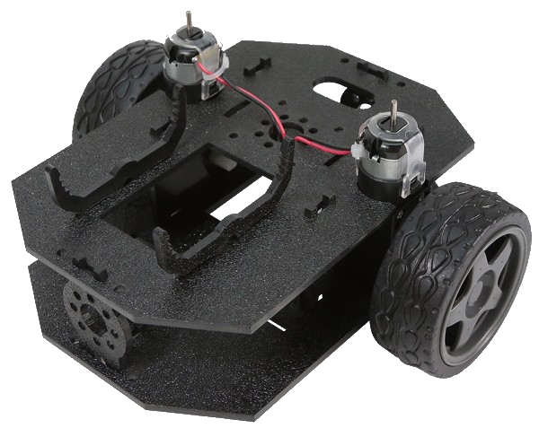
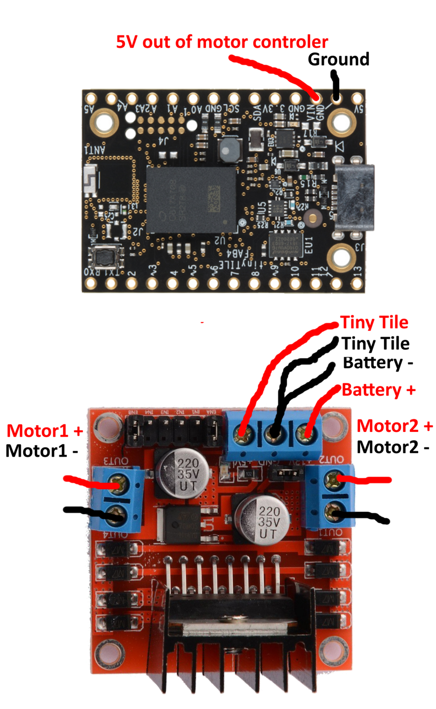
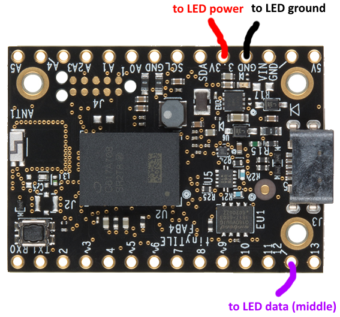
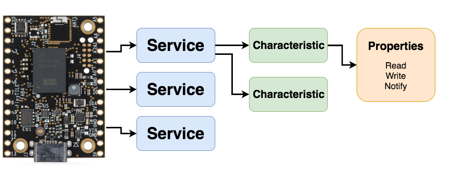

# Build a Nodebot!

## The presentations!

#### Devfest NYC 2017 (2017-12-03)
[Google Presentations](https://docs.google.com/a/ssmcgee.com/presentation/d/1JdGRbhiuv34gFTxBVfpyMSgligORqm-Em2-0M5ZWWm8/edit?usp=sharing)

#### DevFest Muncie 2017 (2017-11-04)
[Google Presentations](https://docs.google.com/presentation/d/1uFcKQna4vpVr70hDIRsu3QGicuoHer7K3At79QF0rHs/edit?usp=sharing)

#### WTM Tucson Hackathon 2017 (2017-10-01)
[Google Presentations](https://docs.google.com/a/ssmcgee.com/presentation/d/1qHpehuctY7qEv9xZZvn576_tejUQWGwgxtaPSUcAveQ/edit?usp=sharing)

## Chirpers (easy way to program using a web browser!)

[https://chirpers.com/browser/#](https://chirpers.com/browser/#)

## Intel Tiny Tile

Intel's Arduino IDE programmable BLE board

The firmware we're using: <br>
https://github.com/monteslu/ble-io/tree/master/arduino/curie_plus

## Bot Assembly

[bot assembly video](https://www.youtube.com/watch?v=LGfNfUv5Eqs)

<a href="https://www.youtube.com/watch?v=LGfNfUv5Eqs"></a>

* build the chassis (see video above)
* connect motors to the motor controller
* connect battery pack to the motor controller
* connect the motor controller power to the power of the Tiny Tile
* connect the motor controller pins to the Tiny Tile
* connect the LED's to the Tiny Tile
* customize it!

## Wiring Power Motors



## Wiring Pins


## Pagenodes tips

#### directional movement

* Right wheel forward:
digital: `[8,1]` and `[7,0]`

* Left wheel forward:
digital: `[5,1]` and `[4,0]`

* Right wheel reverse:
digital: `[8,0]` and `[7,1]`

* Left wheel reverse:
digital: `[5,0]` and `[4,1]`


#### speed

* Right wheel full speed:
analog: `[9,255]`

* Left wheel full speed:
analog: `[3,255]`

* Right wheel STOP:
analog: `[9,0]`

* Left wheel STOP:
analog: `[3,0]`


#### LEDs

* curie/neopixel Characteristic `2a5b`

* one pixel: `[3,12,2, 0,0,200]` - [pixel command, pin #, pixel #,  R, G, B]

* whole strip: `[4,12,2, 127,255,100]` - [strip command, pin #,  R, G, B]

* multiple pixels: `[3,12, 2, 127,255,100, 1, 255,0,10]` - [pixel command, pin #, pixel#,  R, G, B, pixel #,  R, G, B]


#### Bot connecting notes

* service Id: `bada5555-e91f-1337-a49b-8675309fb099`

* digital Characteristic `2a56`

* analog Characteristic `2a58`

more details [here](https://github.com/monteslu/ble-io/blob/master/service.md)


## Using the IoT Buttons in Chirpers

With this, you can use the IoT Controls in Chirpers (look in the hamburger menu). Copy this code and then paste it into Chirpers.

```javascript
[{"id":"6hhqqI1I-Ls","type":"bluetooth out","z":"49fb777.a30e588","name":"digital","characteristicId":"2a56","bleServiceId":"bada5555-e91f-1337-a49b-8675309fb099","x":715.5,"y":286,"wires":[]},{"id":"dd6R088sIXc","type":"bluetooth out","z":"49fb777.a30e588","name":"analog","characteristicId":"2a58","bleServiceId":"bada5555-e91f-1337-a49b-8675309fb099","x":639.5,"y":473,"wires":[]},{"id":"kkgJpERfIvw","type":"iot buttons","z":"49fb777.a30e588","x":87.5,"y":180,"wires":[["vKL1gU1CZ18"]]},{"id":"vKL1gU1CZ18","type":"switch","z":"49fb777.a30e588","name":"","property":"payload","propertyType":"msg","rules":[{"t":"eq","v":"2","vt":"num"},{"t":"eq","v":"10","vt":"num"},{"t":"eq","v":"5","vt":"num"},{"t":"eq","v":"7","vt":"num"},{"t":"eq","v":"6","vt":"num"},{"t":"eq","v":"4","vt":"num"},{"t":"eq","v":"8","vt":"num"},{"t":"eq","v":"1","vt":"str"}],"checkall":"true","outputs":8,"x":149.5,"y":349,"wires":[["17AfuHvqwJM","QGG7QoVH8lo"],["qTXb5mvCQPU","qApozIfAPgs"],["17AfuHvqwJM","qApozIfAPgs"],["QGG7QoVH8lo","qTXb5mvCQPU"],["uNYP8SMzLNU"],["nkmVgTucYeA"],["nCzKIz4sCy0"],[]]},{"id":"uNYP8SMzLNU","type":"change","z":"49fb777.a30e588","name":"stop right & left","rules":[{"t":"set","p":"payload","pt":"msg","to":"[9,0,0,3,0,0]","tot":"json"}],"action":"","property":"","from":"","to":"","reg":false,"x":403.5,"y":396,"wires":[["dd6R088sIXc"]]},{"id":"nkmVgTucYeA","type":"change","z":"49fb777.a30e588","name":"med right & left","rules":[{"t":"set","p":"payload","pt":"msg","to":"[9,127,0,3,127,0]","tot":"json"}],"action":"","property":"","from":"","to":"","reg":false,"x":404.5,"y":452,"wires":[["dd6R088sIXc"]]},{"id":"nCzKIz4sCy0","type":"change","z":"49fb777.a30e588","name":"high right & left","rules":[{"t":"set","p":"payload","pt":"msg","to":"[9,255,0,3,255,0]","tot":"json"}],"action":"","property":"","from":"","to":"","reg":false,"x":423.5,"y":525,"wires":[["dd6R088sIXc"]]},{"id":"17AfuHvqwJM","type":"change","z":"49fb777.a30e588","name":"forward right","rules":[{"t":"set","p":"payload","pt":"msg","to":"[8,1,7,0]","tot":"json"}],"action":"","property":"","from":"","to":"","reg":false,"x":414.5,"y":61,"wires":[["6hhqqI1I-Ls"]]},{"id":"QGG7QoVH8lo","type":"change","z":"49fb777.a30e588","name":"forward left","rules":[{"t":"set","p":"payload","pt":"msg","to":"[5,1,4,0]","tot":"json"}],"action":"","property":"","from":"","to":"","reg":false,"x":422.5,"y":153,"wires":[["6hhqqI1I-Ls"]]},{"id":"qTXb5mvCQPU","type":"change","z":"49fb777.a30e588","name":"reverse right","rules":[{"t":"set","p":"payload","pt":"msg","to":"[8,0,7,1]","tot":"json"}],"action":"","property":"","from":"","to":"","reg":false,"x":433.5,"y":226,"wires":[["6hhqqI1I-Ls"]]},{"id":"qApozIfAPgs","type":"change","z":"49fb777.a30e588","name":"reverse left","rules":[{"t":"set","p":"payload","pt":"msg","to":"[5,0,4,1]","tot":"json"}],"action":"","property":"","from":"","to":"","reg":false,"x":434.5,"y":293,"wires":[["6hhqqI1I-Ls"]]}]
```

## Wiring up the LEDs



## LEDs manual control with Chirpers

```javascript
[{"id":"AKlTtS5hJ1w","type":"bluetooth out","z":"95cc07fa.4951b8","name":"curie","characteristicId":"2a5b","bleServiceId":"bada5555-e91f-1337-a49b-8675309fb099","x":644,"y":1335,"wires":[]},{"id":"lRWRmGn-ln8","type":"inject","z":"95cc07fa.4951b8","name":"red strip","topic":"","payload":"[4,12,255,0,0]","payloadType":"json","repeat":"","crontab":"","once":true,"allowDebugInput":false,"x":205,"y":1250,"wires":[["AKlTtS5hJ1w"]]},{"id":"ilIBUZT_xHk","type":"inject","z":"95cc07fa.4951b8","name":"turn off","topic":"","payload":"[4,12, 0,0,0]","payloadType":"json","repeat":"","crontab":"","once":false,"allowDebugInput":false,"x":274,"y":1112,"wires":[["AKlTtS5hJ1w"]]},{"id":"eGgeA7RtqDE","type":"inject","z":"95cc07fa.4951b8","name":"pixel 2 blue","topic":"","payload":"[3,12,2, 0,0,200]","payloadType":"json","repeat":"","crontab":"","once":false,"allowDebugInput":false,"x":198,"y":1308,"wires":[["AKlTtS5hJ1w"]]},{"id":"u5vRu_Jv02M","type":"inject","z":"95cc07fa.4951b8","name":"pixel 0 - 3 first half rainbow","topic":"","payload":"[3,12,  0, 148,0,211,  1, 75,0,130,  2, 0,0,255,  3, 0,255,0 ]","payloadType":"json","repeat":"","crontab":"","once":false,"allowDebugInput":false,"x":222,"y":1382,"wires":[["AKlTtS5hJ1w"]]},{"id":"U6gluBpm74c","type":"inject","z":"95cc07fa.4951b8","name":"pixel 4 - 7 second half rainbow","topic":"","payload":"[3,12,  4, 255,255,0,  5, 255,127,0,  6, 255,0,0,  7, 127,0,0 ]","payloadType":"json","repeat":"","crontab":"","once":false,"allowDebugInput":false,"x":232,"y":1426,"wires":[["AKlTtS5hJ1w"]]},{"id":"AYRzn7Ct7GI","type":"inject","z":"95cc07fa.4951b8","name":"green strip","topic":"","payload":"[4,12,0,255,0]","payloadType":"json","repeat":"","crontab":"","once":true,"allowDebugInput":false,"x":216,"y":1207,"wires":[["AKlTtS5hJ1w"]]},{"id":"OX9rasy4RKo","type":"inject","z":"95cc07fa.4951b8","name":"blue strip","topic":"","payload":"[4,12,0,0,255]","payloadType":"json","repeat":"","crontab":"","once":true,"allowDebugInput":false,"x":223,"y":1161,"wires":[["AKlTtS5hJ1w"]]},{"id":"uW-2s9U-M1w","type":"inject","z":"95cc07fa.4951b8","name":"white strip","topic":"","payload":"[4,12,255,255,255]","payloadType":"json","repeat":"","crontab":"","once":true,"allowDebugInput":false,"x":301,"y":1492,"wires":[["AKlTtS5hJ1w"]]}]
```

## Chirpers Example using the Gamepad

```javascript
[{"id":"EOD-5sDAqoM","type":"bluetooth out","z":"GVRIYaaKF9I","name":"digital","characteristicId":"2a56","bleServiceId":"bada5555-e91f-1337-a49b-8675309fb099","x":923.0714645385742,"y":465.2856788635254,"wires":[]},{"id":"BAtsltu4B_M","type":"bluetooth out","z":"GVRIYaaKF9I","name":"analog","characteristicId":"2a58","bleServiceId":"bada5555-e91f-1337-a49b-8675309fb099","x":909.5000286102295,"y":160.28571701049805,"wires":[]},{"id":"9MkFzlmOdDg","type":"gamepad","z":"GVRIYaaKF9I","name":"snes-pad1","controllerId":"0","refreshInterval":"60","onlyButtonChanges":false,"roundAxes":true,"x":186.35713958740234,"y":325.714298248291,"wires":[["uvbETkczet8","saQPVQ1Soeg","wgRkYEtuLAk","YlQdKXpDWfg","udqeE7qhXJ0"]]},{"id":"uvbETkczet8","type":"switch","z":"GVRIYaaKF9I","name":"swForward","property":"payload.axes[1]","propertyType":"msg","rules":[{"t":"eq","v":"-1","vt":"num"},{"t":"eq","v":"0","vt":"str"}],"checkall":"true","outputs":2,"x":383.64286041259766,"y":122.57142925262451,"wires":[["Obth86UbJjU","qsc10SA97UY","53_CLRdtJ7s"],[]]},{"id":"Obth86UbJjU","type":"change","z":"GVRIYaaKF9I","name":"forward right","rules":[{"t":"set","p":"payload","pt":"msg","to":"[8,1,7,0]","tot":"json"}],"action":"","property":"","from":"","to":"","reg":false,"x":617.7857208251953,"y":118.14286994934082,"wires":[["EOD-5sDAqoM"]]},{"id":"qsc10SA97UY","type":"change","z":"GVRIYaaKF9I","name":"high right & left","rules":[{"t":"set","p":"payload","pt":"msg","to":"[9,255,0,3,255,0]","tot":"json"}],"action":"","property":"","from":"","to":"","reg":false,"x":621.3571548461914,"y":73.14285945892334,"wires":[["BAtsltu4B_M"]]},{"id":"53_CLRdtJ7s","type":"change","z":"GVRIYaaKF9I","name":"forward left","rules":[{"t":"set","p":"payload","pt":"msg","to":"[5,1,4,0]","tot":"json"}],"action":"","property":"","from":"","to":"","reg":false,"x":614.7857208251953,"y":161.57143783569336,"wires":[["EOD-5sDAqoM"]]},{"id":"NPDLFyHaBSs","type":"change","z":"GVRIYaaKF9I","name":"stop right & left","rules":[{"t":"set","p":"payload","pt":"msg","to":"[9,0,0,3,0,0]","tot":"json"}],"action":"","property":"","from":"","to":"","reg":false,"x":621.9285202026367,"y":370.0000023841858,"wires":[["BAtsltu4B_M"]]},{"id":"ebUyVAtI2DM","type":"change","z":"GVRIYaaKF9I","name":"high right & left","rules":[{"t":"set","p":"payload","pt":"msg","to":"[9,255,0,3,255,0]","tot":"json"}],"action":"","property":"","from":"","to":"","reg":false,"x":638.9286231994629,"y":521.0000152587891,"wires":[["BAtsltu4B_M"]]},{"id":"k7hQRgogjcA","type":"change","z":"GVRIYaaKF9I","name":"forward left","rules":[{"t":"set","p":"payload","pt":"msg","to":"[5,1,4,0]","tot":"json"}],"action":"","property":"","from":"","to":"","reg":false,"x":626.3571128845215,"y":621.0000419616699,"wires":[["EOD-5sDAqoM"]]},{"id":"giSNSZps0uI","type":"change","z":"GVRIYaaKF9I","name":"reverse left","rules":[{"t":"set","p":"payload","pt":"msg","to":"[5,0,4,1]","tot":"json"}],"action":"","property":"","from":"","to":"","reg":false,"x":634.2142944335938,"y":416.00000190734863,"wires":[["EOD-5sDAqoM"]]},{"id":"EUQsvxtcq8Y","type":"change","z":"GVRIYaaKF9I","name":"forward right","rules":[{"t":"set","p":"payload","pt":"msg","to":"[8,1,7,0]","tot":"json"}],"action":"","property":"","from":"","to":"","reg":false,"x":633.3571319580078,"y":460.42858123779297,"wires":[["EOD-5sDAqoM"]]},{"id":"6fywZa-LRLo","type":"change","z":"GVRIYaaKF9I","name":"reverse right","rules":[{"t":"set","p":"payload","pt":"msg","to":"[8,0,7,1]","tot":"json"}],"action":"","property":"","from":"","to":"","reg":false,"x":631.6428375244141,"y":577.7142906188965,"wires":[["EOD-5sDAqoM"]]},{"id":"saQPVQ1Soeg","type":"function","z":"GVRIYaaKF9I","name":"fnStop","func":"var axes = msg.payload.axes;\nvar [x, y] = axes;\nvar ret;\nif(x==0 && y==0) {\n    ret = msg;\n} \nreturn ret;","outputs":1,"noerr":0,"x":387.3571662902832,"y":372.4285697937012,"wires":[["NPDLFyHaBSs"]]},{"id":"wgRkYEtuLAk","type":"switch","z":"GVRIYaaKF9I","name":"swTurnRight","property":"payload.axes[0]","propertyType":"msg","rules":[{"t":"eq","v":"-1","vt":"str"}],"checkall":"true","outputs":1,"x":404.78570556640625,"y":495.85717010498047,"wires":[["ebUyVAtI2DM","giSNSZps0uI","EUQsvxtcq8Y"]]},{"id":"YlQdKXpDWfg","type":"switch","z":"GVRIYaaKF9I","name":"swTurnLeft","property":"payload.axes[0]","propertyType":"msg","rules":[{"t":"eq","v":"1","vt":"str"}],"checkall":"true","outputs":1,"x":407.07141876220703,"y":554.7142715454102,"wires":[["ebUyVAtI2DM","k7hQRgogjcA","6fywZa-LRLo"]]},{"id":"udqeE7qhXJ0","type":"switch","z":"GVRIYaaKF9I","name":"swReverse","property":"payload.axes[1]","propertyType":"msg","rules":[{"t":"eq","v":"1","vt":"num"}],"checkall":"true","outputs":1,"x":387.9285888671875,"y":279.999981880188,"wires":[["UamtW8Jh-c0","t_k2E4xA2-Q","IXesNgryRrQ"]]},{"id":"t_k2E4xA2-Q","type":"change","z":"GVRIYaaKF9I","name":"reverse right","rules":[{"t":"set","p":"payload","pt":"msg","to":"[8,0,7,1]","tot":"json"}],"action":"","property":"","from":"","to":"","reg":false,"x":616.7856674194336,"y":312.9999465942383,"wires":[["EOD-5sDAqoM"]]},{"id":"UamtW8Jh-c0","type":"change","z":"GVRIYaaKF9I","name":"reverse left","rules":[{"t":"set","p":"payload","pt":"msg","to":"[5,0,4,1]","tot":"json"}],"action":"","property":"","from":"","to":"","reg":false,"x":615.3571662902832,"y":271.85713386535645,"wires":[["EOD-5sDAqoM"]]},{"id":"IXesNgryRrQ","type":"change","z":"GVRIYaaKF9I","name":"high right & left","rules":[{"t":"set","p":"payload","pt":"msg","to":"[9,255,0,3,255,0]","tot":"json"}],"action":"","property":"","from":"","to":"","reg":false,"x":619.2141723632812,"y":230.14286422729492,"wires":[["BAtsltu4B_M"]]}]
```


##Chirpers Example using the Gamepad and almost voice

```javascript
[{"id":"vMaTrfNrAkc","type":"bluetooth out","z":"9Al_hXlZu38","name":"digital","deviceName":"digital","characteristicId":"2a56","bleServiceId":"bada5555-e91f-1337-a49b-8675309fb099","x":832.7143249511719,"y":844.142819404602,"wires":[]},{"id":"K0JSKsAfUHI","type":"bluetooth out","z":"9Al_hXlZu38","name":"analog","deviceName":"analog","characteristicId":"2a58","bleServiceId":"bada5555-e91f-1337-a49b-8675309fb099","x":819.1428890228271,"y":539.1428575515747,"wires":[]},{"id":"dcmbu0Q6HWs","type":"gamepad","z":"9Al_hXlZu38","name":"snes-pad1","controllerId":"1","refreshInterval":"100","onlyButtonChanges":false,"roundAxes":true,"x":96,"y":704.5714387893677,"wires":[["Tb399fPwY9A","7A2wDXwMy_0","OmnoH2dshxM","8nykwV_bu7s"]]},{"id":"Tb399fPwY9A","type":"switch","z":"9Al_hXlZu38","name":"forward/reverse","property":"payload.axes[1]","propertyType":"msg","rules":[{"t":"eq","v":"-1","vt":"num"},{"t":"eq","v":"1","vt":"str"}],"checkall":"true","outputs":2,"x":294.2857208251953,"y":508.4285583496094,"wires":[["zClnYfmRvvU","SbFDcemSP0M","DNVAN5lyNaU"],["U8HZ6EknAtU","bQHY-r6-eGI","SbFDcemSP0M"]]},{"id":"zClnYfmRvvU","type":"change","z":"9Al_hXlZu38","name":"forward right","rules":[{"t":"set","p":"payload","pt":"msg","to":"[8,1,7,0]","tot":"json"}],"action":"","property":"","from":"","to":"","reg":false,"x":531.4285888671875,"y":666,"wires":[["vMaTrfNrAkc","REfR67vNqhg"]]},{"id":"SbFDcemSP0M","type":"change","z":"9Al_hXlZu38","name":"high right & left","rules":[{"t":"set","p":"payload","pt":"msg","to":"[9,255,0,3,255,0]","tot":"json"}],"action":"","property":"","from":"","to":"","reg":false,"x":556,"y":498,"wires":[["K0JSKsAfUHI","psjIofUgSok"]]},{"id":"DNVAN5lyNaU","type":"change","z":"9Al_hXlZu38","name":"forward left","rules":[{"t":"set","p":"payload","pt":"msg","to":"[5,1,4,0]","tot":"json"}],"action":"","property":"","from":"","to":"","reg":false,"x":529.4285888671875,"y":630.4285888671875,"wires":[["vMaTrfNrAkc","REfR67vNqhg"]]},{"id":"rHFTwpnqpUw","type":"change","z":"9Al_hXlZu38","name":"stop right & left","rules":[{"t":"set","p":"payload","pt":"msg","to":"[9,0,0,3,0,0]","tot":"json"}],"action":"","property":"","from":"","to":"","reg":false,"x":533.5713806152344,"y":787.8571166992188,"wires":[["K0JSKsAfUHI","psjIofUgSok"]]},{"id":"7A2wDXwMy_0","type":"function","z":"9Al_hXlZu38","name":"fnStop","func":"//const myGlobal = await flow.get('myGlobal');\n//flow.set('myGlobal', 1);\n//flow.get('myGlobal').then\n\nvar axes = msg.payload.axes;\nvar [x, y] = axes;\nvar ret;\nif(x===0 && y===0) {\n    //ret = msg;\n    ret = {};\n} \nreturn ret;","outputs":1,"noerr":0,"x":297.00002670288086,"y":751.2857103347778,"wires":[["rHFTwpnqpUw"]]},{"id":"OmnoH2dshxM","type":"switch","z":"9Al_hXlZu38","name":"swTurnRight","property":"payload.axes[0]","propertyType":"msg","rules":[{"t":"eq","v":"-1","vt":"str"}],"checkall":"true","outputs":1,"x":314.4285659790039,"y":874.7143106460571,"wires":[["CKoUklcxLrA","U8HZ6EknAtU","zClnYfmRvvU"]]},{"id":"8nykwV_bu7s","type":"switch","z":"9Al_hXlZu38","name":"swTurnLeft","property":"payload.axes[0]","propertyType":"msg","rules":[{"t":"eq","v":"1","vt":"str"}],"checkall":"true","outputs":1,"x":311.7142791748047,"y":959.5714111328125,"wires":[["CKoUklcxLrA","DNVAN5lyNaU","bQHY-r6-eGI"]]},{"id":"bQHY-r6-eGI","type":"change","z":"9Al_hXlZu38","name":"reverse right","rules":[{"t":"set","p":"payload","pt":"msg","to":"[8,0,7,1]","tot":"json"}],"action":"","property":"","from":"","to":"","reg":false,"x":520.4285278320312,"y":744.8571166992188,"wires":[["vMaTrfNrAkc","REfR67vNqhg"]]},{"id":"U8HZ6EknAtU","type":"change","z":"9Al_hXlZu38","name":"reverse left","rules":[{"t":"set","p":"payload","pt":"msg","to":"[5,0,4,1]","tot":"json"}],"action":"","property":"","from":"","to":"","reg":false,"x":520.0000305175781,"y":706.7142944335938,"wires":[["vMaTrfNrAkc","REfR67vNqhg"]]},{"id":"psjIofUgSok","type":"debug","z":"9Al_hXlZu38","name":"analog","active":false,"console":"false","complete":"true","x":836,"y":641,"wires":[]},{"id":"REfR67vNqhg","type":"debug","z":"9Al_hXlZu38","name":"digital","active":false,"console":"false","complete":"true","x":843,"y":757,"wires":[]},{"id":"CKoUklcxLrA","type":"change","z":"9Al_hXlZu38","name":"mid right & left","rules":[{"t":"set","p":"payload","pt":"msg","to":"[9,150,0,3,150,0]","tot":"json"}],"action":"","property":"","from":"","to":"","reg":false,"x":545,"y":885,"wires":[["psjIofUgSok","K0JSKsAfUHI"]]},{"id":"pLJFy341mAs","type":"debug","z":"9Al_hXlZu38","name":"","active":true,"console":"false","complete":"false","x":572,"y":559,"wires":[]},{"id":"xlzkFmjwf-c","type":"switch","z":"9Al_hXlZu38","name":"VOICE CONTROLS","property":"payload","propertyType":"msg","rules":[{"t":"cont","v":"forward","vt":"str"},{"t":"cont","v":"back","vt":"str"},{"t":"cont","v":"stop","vt":"str"}],"checkall":"false","outputs":3,"x":296,"y":622,"wires":[["DNVAN5lyNaU","zClnYfmRvvU","SbFDcemSP0M"],["U8HZ6EknAtU","bQHY-r6-eGI","SbFDcemSP0M"],["rHFTwpnqpUw"]]}]
```

##Chirpers - all remotes - gameday

```javascript
[{"id":"rYn0z1p23gc","type":"bluetooth out","z":"9Al_hXlZu38","name":"digital","deviceName":"digital","characteristicId":"2a56","bleServiceId":"bada5555-e91f-1337-a49b-8675309fb099","x":800.2143249511719,"y":398.14281940460205,"wires":[]},{"id":"xfTOwq6K-90","type":"bluetooth out","z":"9Al_hXlZu38","name":"analog","deviceName":"analog","characteristicId":"2a58","bleServiceId":"bada5555-e91f-1337-a49b-8675309fb099","x":786.6428890228271,"y":93.1428575515747,"wires":[]},{"id":"mumktz5tgS8","type":"gamepad","z":"9Al_hXlZu38","name":"snes-pad1","controllerId":"0","refreshInterval":"60","onlyButtonChanges":false,"roundAxes":true,"x":63.5,"y":258.5714387893677,"wires":[["f2qalZoe3sk","IzCkx9GwBL0","LE4puCg5s1w","duhkRSStBqM","Oo7gRfb0rkk"]]},{"id":"f2qalZoe3sk","type":"switch","z":"9Al_hXlZu38","name":"forward/reverse","property":"payload.axes[1]","propertyType":"msg","rules":[{"t":"eq","v":"-1","vt":"num"},{"t":"eq","v":"1","vt":"str"}],"checkall":"true","outputs":2,"x":261.7857208251953,"y":62.428558349609375,"wires":[["p6R0r74tckw","1mEL2LAOfPI","wJou86mSbSo"],["vvG2_UPGfNM","a9cnHKBUcfs","1mEL2LAOfPI"]]},{"id":"p6R0r74tckw","type":"change","z":"9Al_hXlZu38","name":"forward right","rules":[{"t":"set","p":"payload","pt":"msg","to":"[8,1,7,0]","tot":"json"}],"action":"","property":"","from":"","to":"","reg":false,"x":498.9285888671875,"y":220,"wires":[["rYn0z1p23gc","YGghRiN7PBE"]]},{"id":"1mEL2LAOfPI","type":"change","z":"9Al_hXlZu38","name":"high right & left","rules":[{"t":"set","p":"payload","pt":"msg","to":"[9,200,0,3,200,0]","tot":"json"}],"action":"","property":"","from":"","to":"","reg":false,"x":523.5,"y":50,"wires":[["xfTOwq6K-90","j9N5AXuB3A4"]]},{"id":"wJou86mSbSo","type":"change","z":"9Al_hXlZu38","name":"forward left","rules":[{"t":"set","p":"payload","pt":"msg","to":"[5,1,4,0]","tot":"json"}],"action":"","property":"","from":"","to":"","reg":false,"x":496.9285888671875,"y":184.4285888671875,"wires":[["rYn0z1p23gc","YGghRiN7PBE"]]},{"id":"ALPCIG93Nm0","type":"change","z":"9Al_hXlZu38","name":"stop right & left","rules":[{"t":"set","p":"payload","pt":"msg","to":"[9,0,0,3,0,0]","tot":"json"}],"action":"","property":"","from":"","to":"","reg":false,"x":501.0713806152344,"y":341.85711669921875,"wires":[["xfTOwq6K-90","j9N5AXuB3A4"]]},{"id":"IzCkx9GwBL0","type":"function","z":"9Al_hXlZu38","name":"fnStop","func":"//const myGlobal = await flow.get('myGlobal');\n//flow.set('myGlobal', 1);\n//flow.get('myGlobal').then\n\nvar axes = msg.payload.axes;\nvar [x, y] = axes;\nvar ret;\nif(x===0 && y===0) {\n    //ret = msg;\n    ret = {};\n} \nreturn ret;","outputs":1,"noerr":0,"x":264.50002670288086,"y":305.28571033477783,"wires":[["ALPCIG93Nm0"]]},{"id":"LE4puCg5s1w","type":"switch","z":"9Al_hXlZu38","name":"swTurnRight","property":"payload.axes[0]","propertyType":"msg","rules":[{"t":"eq","v":"-1","vt":"str"}],"checkall":"true","outputs":1,"x":281.9285659790039,"y":428.71431064605713,"wires":[["XUpS52bNKgI","vvG2_UPGfNM","p6R0r74tckw"]]},{"id":"duhkRSStBqM","type":"switch","z":"9Al_hXlZu38","name":"swTurnLeft","property":"payload.axes[0]","propertyType":"msg","rules":[{"t":"eq","v":"1","vt":"str"}],"checkall":"true","outputs":1,"x":279.2142791748047,"y":513.5714111328125,"wires":[["XUpS52bNKgI","wJou86mSbSo","a9cnHKBUcfs"]]},{"id":"a9cnHKBUcfs","type":"change","z":"9Al_hXlZu38","name":"reverse right","rules":[{"t":"set","p":"payload","pt":"msg","to":"[8,0,7,1]","tot":"json"}],"action":"","property":"","from":"","to":"","reg":false,"x":487.92852783203125,"y":298.85711669921875,"wires":[["rYn0z1p23gc","YGghRiN7PBE"]]},{"id":"vvG2_UPGfNM","type":"change","z":"9Al_hXlZu38","name":"reverse left","rules":[{"t":"set","p":"payload","pt":"msg","to":"[5,0,4,1]","tot":"json"}],"action":"","property":"","from":"","to":"","reg":false,"x":487.5000305175781,"y":260.71429443359375,"wires":[["rYn0z1p23gc","YGghRiN7PBE"]]},{"id":"j9N5AXuB3A4","type":"debug","z":"9Al_hXlZu38","name":"analog","active":false,"console":"false","complete":"true","x":803.5,"y":195,"wires":[]},{"id":"YGghRiN7PBE","type":"debug","z":"9Al_hXlZu38","name":"digital","active":false,"console":"false","complete":"true","x":810.5,"y":311,"wires":[]},{"id":"XUpS52bNKgI","type":"change","z":"9Al_hXlZu38","name":"mid right & left","rules":[{"t":"set","p":"payload","pt":"msg","to":"[9,150,0,3,150,0]","tot":"json"}],"action":"","property":"","from":"","to":"","reg":false,"x":512.5,"y":439,"wires":[["j9N5AXuB3A4","xfTOwq6K-90"]]},{"id":"HSLrkprGvI8","type":"debug","z":"9Al_hXlZu38","name":"","active":true,"console":"false","complete":"false","x":539.5,"y":113,"wires":[]},{"id":"Oo7gRfb0rkk","type":"debug","z":"9Al_hXlZu38","name":"","active":false,"console":"false","complete":"false","x":264,"y":245,"wires":[]},{"id":"3h8zHLDL7SI","type":"gamepad","z":"9Al_hXlZu38","name":"","controllerId":"1","refreshInterval":"60","onlyButtonChanges":false,"roundAxes":true,"x":59.5,"y":300,"wires":[["f2qalZoe3sk","Oo7gRfb0rkk","IzCkx9GwBL0","LE4puCg5s1w","duhkRSStBqM"]]},{"id":"HMh-ckWPfCE","type":"gamepad","z":"9Al_hXlZu38","name":"","controllerId":"2","refreshInterval":"60","onlyButtonChanges":false,"roundAxes":true,"x":59.5,"y":338,"wires":[["f2qalZoe3sk","Oo7gRfb0rkk","IzCkx9GwBL0","LE4puCg5s1w","duhkRSStBqM"]]},{"id":"eUWm6bXZxmE","type":"gamepad","z":"9Al_hXlZu38","name":"","controllerId":"3","refreshInterval":"60","onlyButtonChanges":false,"roundAxes":true,"x":59.5,"y":378,"wires":[["duhkRSStBqM","LE4puCg5s1w","IzCkx9GwBL0","Oo7gRfb0rkk","f2qalZoe3sk"]]},{"id":"5H0EtYniopM","type":"bluetooth out","z":"9Al_hXlZu38","name":"curie","deviceName":"","characteristicId":"2a5b","bleServiceId":"bada5555-e91f-1337-a49b-8675309fb099","x":591,"y":810,"wires":[]},{"id":"LK3tpNiEPjY","type":"inject","z":"9Al_hXlZu38","name":"red strip","topic":"","payload":"[4,12,255,0,0]","payloadType":"json","repeat":"","crontab":"","once":true,"allowDebugInput":false,"x":152,"y":725,"wires":[["5H0EtYniopM"]]},{"id":"2WdK0fytU-s","type":"inject","z":"9Al_hXlZu38","name":"turn off","topic":"","payload":"[4,12, 0,0,0]","payloadType":"json","repeat":"","crontab":"","once":false,"allowDebugInput":false,"x":221,"y":587,"wires":[["5H0EtYniopM"]]},{"id":"t2FwAz2Lty8","type":"inject","z":"9Al_hXlZu38","name":"pixel 2 blue","topic":"","payload":"[3,12,2, 0,0,200]","payloadType":"json","repeat":"","crontab":"","once":false,"allowDebugInput":false,"x":145,"y":783,"wires":[["5H0EtYniopM"]]},{"id":"kADpkE-RtB8","type":"inject","z":"9Al_hXlZu38","name":"pixel 0 - 3 first half rainbow","topic":"","payload":"[3,12,  0, 148,0,211,  1, 75,0,130,  2, 0,0,255,  3, 0,255,0 ]","payloadType":"json","repeat":"","crontab":"","once":false,"allowDebugInput":false,"x":169,"y":857,"wires":[["5H0EtYniopM"]]},{"id":"IsQfGOuUCPE","type":"inject","z":"9Al_hXlZu38","name":"pixel 4 - 7 second half rainbow","topic":"","payload":"[3,12,  4, 255,255,0,  5, 255,127,0,  6, 255,0,0,  7, 127,0,0 ]","payloadType":"json","repeat":"","crontab":"","once":false,"allowDebugInput":false,"x":179,"y":901,"wires":[["5H0EtYniopM"]]},{"id":"Aga0N0zXcpE","type":"inject","z":"9Al_hXlZu38","name":"green strip","topic":"","payload":"[4,12,0,255,0]","payloadType":"json","repeat":"","crontab":"","once":true,"allowDebugInput":false,"x":163,"y":682,"wires":[["5H0EtYniopM"]]},{"id":"SNQKevhCCPw","type":"inject","z":"9Al_hXlZu38","name":"blue strip","topic":"","payload":"[4,12,0,0,255]","payloadType":"json","repeat":"","crontab":"","once":true,"allowDebugInput":false,"x":170,"y":636,"wires":[["5H0EtYniopM"]]},{"id":"8Bo-4sGs46A","type":"inject","z":"9Al_hXlZu38","name":"white strip","topic":"","payload":"[4,12,255,255,255]","payloadType":"json","repeat":"","crontab":"","once":true,"allowDebugInput":false,"x":263,"y":1027,"wires":[["5H0EtYniopM"]]},{"id":"8HSqCV7UoHk","type":"inject","z":"9Al_hXlZu38","name":"pixel 0 - 3 first half rainbow","topic":"","payload":"[3,12,  8, 148,0,211,  9, 75,0,130,  10, 0,0,255,  11, 0,255,0 ]","payloadType":"json","repeat":"","crontab":"","once":false,"allowDebugInput":false,"x":184,"y":952,"wires":[["5H0EtYniopM"]]},{"id":"sWB23OcsqzQ","type":"inject","z":"9Al_hXlZu38","name":"pixel 4 - 7 second half rainbow","topic":"","payload":"[3,12,  12, 255,255,0,  13, 255,127,0,  14, 255,0,0,  15, 127,0,0 ]","payloadType":"json","repeat":"","crontab":"","once":false,"allowDebugInput":false,"x":177,"y":986,"wires":[["5H0EtYniopM"]]}]
```


## What is Bluetooth Low Energy?



#### The End
