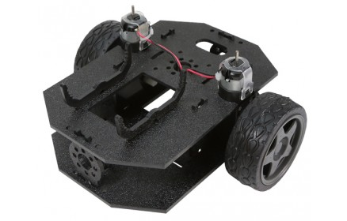

# WTM Tucson Hackathon 2017 <br> (Build a Nodebot!)

## What is Bluetooth Low Energy?


## Pagenodes (the "node" in nodebots)

[https://pagenodes.com](https://pagenodes.com)


## Intel Tiny Tile

Intel's Arduino IDE programmable BLE chip.

The firmware we're using:  https://github.com/monteslu/ble-io/tree/master/arduino/curie_plus

## Bot Assembly

[bot assembly video](https://www.youtube.com/watch?v=LGfNfUv5Eqs)

<a href="https://www.youtube.com/watch?v=LGfNfUv5Eqs"></a>

* build the chassis
* connect motors to the motor controller
* connect battery pack to the motor controller
* connect the motor controller power to the power of the Tiny Tile
* connect the motor controller pins to the Tiny Tile
* connect the LED's to the Tiny Tile
* customize!


# Pagenodes tips

### directional movement

* Right wheel forward:
digital: `[8,1]` and `[7,0]`

* Left wheel forward:
digital: `[5,1]` and `[4,0]`

* Right wheel reverse:
digital: `[8,0]` and `[7,1]`

* Left wheel reverse:
digital: `[5,0]` and `[4,1]`


### speed

* Right wheel full speed:
analog: `[9,255]`

* Left wheel full speed:
analog: `[3,255]`

* Right wheel STOP:
analog: `[9,0]`

* Left wheel STOP:
analog: `[3,0]`


### LEDs

* curie/neopixel Characteristic `2a5b`

* one pixel: `[3,12,2, 0,0,200]` - [pixel command, pin #, pixel #,  R, G, B]

* whole strip: `[4,12,2, 127,255,100]` - [strip command, pin #,  R, G, B]

* multiple pixels: `[3,12, 2, 127,255,100, 1, 255,0,10]` - [pixel command, pin #, pixel#,  R, G, B, pixel #,  R, G, B]


### Bot connecting notes

* service Id: `bada5555-e91f-1337-a49b-8675309fb099`

* digital Characteristic `2a56`

* analog Characteristic `2a58`

more details [here](https://github.com/monteslu/ble-io/blob/master/service.md)


## Using the IoT Buttons in Pagenodes

With this, you can use the IoT Controls in pagenode (look in the hamburger menu). Copy this code and then paste it into pagenodes.

```javascript
[{"id":"6hhqqI1I-Ls","type":"bluetooth out","z":"49fb777.a30e588","name":"digital","characteristicId":"2a56","bleServiceId":"bada5555-e91f-1337-a49b-8675309fb099","x":715.5,"y":286,"wires":[]},{"id":"dd6R088sIXc","type":"bluetooth out","z":"49fb777.a30e588","name":"analog","characteristicId":"2a58","bleServiceId":"bada5555-e91f-1337-a49b-8675309fb099","x":639.5,"y":473,"wires":[]},{"id":"kkgJpERfIvw","type":"iot buttons","z":"49fb777.a30e588","x":87.5,"y":180,"wires":[["vKL1gU1CZ18"]]},{"id":"vKL1gU1CZ18","type":"switch","z":"49fb777.a30e588","name":"","property":"payload","propertyType":"msg","rules":[{"t":"eq","v":"2","vt":"num"},{"t":"eq","v":"10","vt":"num"},{"t":"eq","v":"5","vt":"num"},{"t":"eq","v":"7","vt":"num"},{"t":"eq","v":"6","vt":"num"},{"t":"eq","v":"4","vt":"num"},{"t":"eq","v":"8","vt":"num"},{"t":"eq","v":"1","vt":"str"}],"checkall":"true","outputs":8,"x":149.5,"y":349,"wires":[["17AfuHvqwJM","QGG7QoVH8lo"],["qTXb5mvCQPU","qApozIfAPgs"],["17AfuHvqwJM","qApozIfAPgs"],["QGG7QoVH8lo","qTXb5mvCQPU"],["uNYP8SMzLNU"],["nkmVgTucYeA"],["nCzKIz4sCy0"],[]]},{"id":"uNYP8SMzLNU","type":"change","z":"49fb777.a30e588","name":"stop right & left","rules":[{"t":"set","p":"payload","pt":"msg","to":"[9,0,0,3,0,0]","tot":"json"}],"action":"","property":"","from":"","to":"","reg":false,"x":403.5,"y":396,"wires":[["dd6R088sIXc"]]},{"id":"nkmVgTucYeA","type":"change","z":"49fb777.a30e588","name":"med right & left","rules":[{"t":"set","p":"payload","pt":"msg","to":"[9,127,0,3,127,0]","tot":"json"}],"action":"","property":"","from":"","to":"","reg":false,"x":404.5,"y":452,"wires":[["dd6R088sIXc"]]},{"id":"nCzKIz4sCy0","type":"change","z":"49fb777.a30e588","name":"high right & left","rules":[{"t":"set","p":"payload","pt":"msg","to":"[9,255,0,3,255,0]","tot":"json"}],"action":"","property":"","from":"","to":"","reg":false,"x":423.5,"y":525,"wires":[["dd6R088sIXc"]]},{"id":"17AfuHvqwJM","type":"change","z":"49fb777.a30e588","name":"forward right","rules":[{"t":"set","p":"payload","pt":"msg","to":"[8,1,7,0]","tot":"json"}],"action":"","property":"","from":"","to":"","reg":false,"x":414.5,"y":61,"wires":[["6hhqqI1I-Ls"]]},{"id":"QGG7QoVH8lo","type":"change","z":"49fb777.a30e588","name":"forward left","rules":[{"t":"set","p":"payload","pt":"msg","to":"[5,1,4,0]","tot":"json"}],"action":"","property":"","from":"","to":"","reg":false,"x":422.5,"y":153,"wires":[["6hhqqI1I-Ls"]]},{"id":"qTXb5mvCQPU","type":"change","z":"49fb777.a30e588","name":"reverse right","rules":[{"t":"set","p":"payload","pt":"msg","to":"[8,0,7,1]","tot":"json"}],"action":"","property":"","from":"","to":"","reg":false,"x":433.5,"y":226,"wires":[["6hhqqI1I-Ls"]]},{"id":"qApozIfAPgs","type":"change","z":"49fb777.a30e588","name":"reverse left","rules":[{"t":"set","p":"payload","pt":"msg","to":"[5,0,4,1]","tot":"json"}],"action":"","property":"","from":"","to":"","reg":false,"x":434.5,"y":293,"wires":[["6hhqqI1I-Ls"]]}]
```


## LEDs manual control

```javascript
[{"id":"AKlTtS5hJ1w","type":"bluetooth out","z":"95cc07fa.4951b8","name":"curie","characteristicId":"2a5b","bleServiceId":"bada5555-e91f-1337-a49b-8675309fb099","x":644,"y":1335,"wires":[]},{"id":"lRWRmGn-ln8","type":"inject","z":"95cc07fa.4951b8","name":"red strip","topic":"","payload":"[4,12,255,0,0]","payloadType":"json","repeat":"","crontab":"","once":true,"allowDebugInput":false,"x":205,"y":1250,"wires":[["AKlTtS5hJ1w"]]},{"id":"ilIBUZT_xHk","type":"inject","z":"95cc07fa.4951b8","name":"turn off","topic":"","payload":"[4,12, 0,0,0]","payloadType":"json","repeat":"","crontab":"","once":false,"allowDebugInput":false,"x":274,"y":1112,"wires":[["AKlTtS5hJ1w"]]},{"id":"eGgeA7RtqDE","type":"inject","z":"95cc07fa.4951b8","name":"pixel 2 blue","topic":"","payload":"[3,12,2, 0,0,200]","payloadType":"json","repeat":"","crontab":"","once":false,"allowDebugInput":false,"x":198,"y":1308,"wires":[["AKlTtS5hJ1w"]]},{"id":"u5vRu_Jv02M","type":"inject","z":"95cc07fa.4951b8","name":"pixel 0 - 3 first half rainbow","topic":"","payload":"[3,12,  0, 148,0,211,  1, 75,0,130,  2, 0,0,255,  3, 0,255,0 ]","payloadType":"json","repeat":"","crontab":"","once":false,"allowDebugInput":false,"x":222,"y":1382,"wires":[["AKlTtS5hJ1w"]]},{"id":"U6gluBpm74c","type":"inject","z":"95cc07fa.4951b8","name":"pixel 4 - 7 second half rainbow","topic":"","payload":"[3,12,  4, 255,255,0,  5, 255,127,0,  6, 255,0,0,  7, 127,0,0 ]","payloadType":"json","repeat":"","crontab":"","once":false,"allowDebugInput":false,"x":232,"y":1426,"wires":[["AKlTtS5hJ1w"]]},{"id":"AYRzn7Ct7GI","type":"inject","z":"95cc07fa.4951b8","name":"green strip","topic":"","payload":"[4,12,0,255,0]","payloadType":"json","repeat":"","crontab":"","once":true,"allowDebugInput":false,"x":216,"y":1207,"wires":[["AKlTtS5hJ1w"]]},{"id":"OX9rasy4RKo","type":"inject","z":"95cc07fa.4951b8","name":"blue strip","topic":"","payload":"[4,12,0,0,255]","payloadType":"json","repeat":"","crontab":"","once":true,"allowDebugInput":false,"x":223,"y":1161,"wires":[["AKlTtS5hJ1w"]]},{"id":"uW-2s9U-M1w","type":"inject","z":"95cc07fa.4951b8","name":"white strip","topic":"","payload":"[4,12,255,255,255]","payloadType":"json","repeat":"","crontab":"","once":true,"allowDebugInput":false,"x":301,"y":1492,"wires":[["AKlTtS5hJ1w"]]}]
```

[pixels.json](https://gist.github.com/monteslu/e95bc1323fe16c5e937a5374744853d3)

## Example using the Gamepad

```javascript
[{"id":"lGtmbXU889c","type":"debug","z":"95cc07fa.4951b8","name":"dbgOut","active":false,"console":"false","complete":"true","x":919,"y":871,"wires":[]},{"id":"Paps6BjAe6M","type":"bluetooth out","z":"95cc07fa.4951b8","name":"digital","characteristicId":"2a56","bleServiceId":"bada5555-e91f-1337-a49b-8675309fb099","x":757,"y":920,"wires":[]},{"id":"kwAW_Ncq8z4","type":"bluetooth out","z":"95cc07fa.4951b8","name":"analog","characteristicId":"2a58","bleServiceId":"bada5555-e91f-1337-a49b-8675309fb099","x":872,"y":405,"wires":[]},{"id":"OFM4NmOZqeM","type":"gamepad","z":"95cc07fa.4951b8","name":"snes-pad","controllerId":"1","refreshInterval":"60","onlyButtonChanges":false,"roundAxes":true,"x":59.5,"y":483,"wires":[["C2H2YWIlaEQ","qQkizms85u0","a3KF79pWPAg","xfPIGd8oUUA","AZdMtjqiVlI"]]},{"id":"C2H2YWIlaEQ","type":"switch","z":"95cc07fa.4951b8","name":"swForward","property":"payload.axes[1]","propertyType":"msg","rules":[{"t":"eq","v":"-1","vt":"num"},{"t":"eq","v":"0","vt":"str"}],"checkall":"true","outputs":2,"x":219,"y":263,"wires":[["R1T6MwQBHGE","13mn7q529Ag","dTVIG26dXNI"],[]]},{"id":"R1T6MwQBHGE","type":"change","z":"95cc07fa.4951b8","name":"forward right","rules":[{"t":"set","p":"payload","pt":"msg","to":"[8,1,7,0]","tot":"json"}],"action":"","property":"","from":"","to":"","reg":false,"x":416,"y":20,"wires":[["Paps6BjAe6M"]]},{"id":"13mn7q529Ag","type":"change","z":"95cc07fa.4951b8","name":"high right & left","rules":[{"t":"set","p":"payload","pt":"msg","to":"[9,255,0,3,255,0]","tot":"json"}],"action":"","property":"","from":"","to":"","reg":false,"x":421,"y":85,"wires":[["kwAW_Ncq8z4"]]},{"id":"dTVIG26dXNI","type":"change","z":"95cc07fa.4951b8","name":"forward left","rules":[{"t":"set","p":"payload","pt":"msg","to":"[5,1,4,0]","tot":"json"}],"action":"","property":"","from":"","to":"","reg":false,"x":413,"y":52,"wires":[["Paps6BjAe6M"]]},{"id":"e5LEJCw2Yb4","type":"change","z":"95cc07fa.4951b8","name":"stop right & left","rules":[{"t":"set","p":"payload","pt":"msg","to":"[9,0,0,3,0,0]","tot":"json"}],"action":"","property":"","from":"","to":"","reg":false,"x":493,"y":209,"wires":[["kwAW_Ncq8z4"]]},{"id":"9jlU4oKLY2c","type":"change","z":"95cc07fa.4951b8","name":"reverse right","rules":[{"t":"set","p":"payload","pt":"msg","to":"[8,0,7,1]","tot":"json"}],"action":"","property":"","from":"","to":"","reg":false,"x":464,"y":300,"wires":[["Paps6BjAe6M"]]},{"id":"h973LeYamWg","type":"change","z":"95cc07fa.4951b8","name":"reverse left","rules":[{"t":"set","p":"payload","pt":"msg","to":"[5,0,4,1]","tot":"json"}],"action":"","property":"","from":"","to":"","reg":false,"x":474,"y":343,"wires":[["Paps6BjAe6M"]]},{"id":"mNp8JkfdqUs","type":"change","z":"95cc07fa.4951b8","name":"high right & left","rules":[{"t":"set","p":"payload","pt":"msg","to":"[9,255,0,3,255,0]","tot":"json"}],"action":"","property":"","from":"","to":"","reg":false,"x":470,"y":393,"wires":[[]]},{"id":"-NODcT7hC2E","type":"change","z":"95cc07fa.4951b8","name":"high right & left","rules":[{"t":"set","p":"payload","pt":"msg","to":"[9,255,0,3,255,0]","tot":"json"}],"action":"","property":"","from":"","to":"","reg":false,"x":480,"y":760,"wires":[["kwAW_Ncq8z4"]]},{"id":"kPswA027SEk","type":"change","z":"95cc07fa.4951b8","name":"forward left","rules":[{"t":"set","p":"payload","pt":"msg","to":"[5,1,4,0]","tot":"json"}],"action":"","property":"","from":"","to":"","reg":false,"x":474,"y":829,"wires":[["Paps6BjAe6M"]]},{"id":"KwRFl-oLn28","type":"change","z":"95cc07fa.4951b8","name":"reverse left","rules":[{"t":"set","p":"payload","pt":"msg","to":"[5,0,4,1]","tot":"json"}],"action":"","property":"","from":"","to":"","reg":false,"x":471,"y":625,"wires":[["Paps6BjAe6M"]]},{"id":"U50V66ZjV6o","type":"change","z":"95cc07fa.4951b8","name":"forward right","rules":[{"t":"set","p":"payload","pt":"msg","to":"[8,1,7,0]","tot":"json"}],"action":"","property":"","from":"","to":"","reg":false,"x":473,"y":658,"wires":[["Paps6BjAe6M"]]},{"id":"O_sx2TNINz4","type":"change","z":"95cc07fa.4951b8","name":"reverse right","rules":[{"t":"set","p":"payload","pt":"msg","to":"[8,0,7,1]","tot":"json"}],"action":"","property":"","from":"","to":"","reg":false,"x":477,"y":863,"wires":[["Paps6BjAe6M"]]},{"id":"qQkizms85u0","type":"function","z":"95cc07fa.4951b8","name":"fnStop","func":"var axes = msg.payload.axes;\nvar [x, y, z] = axes;\nvar ret;\nif(x==0 && y==0 && z==0) {\n    ret = msg;\n} \nreturn ret;","outputs":1,"noerr":0,"x":217,"y":410,"wires":[["e5LEJCw2Yb4","lGtmbXU889c"]]},{"id":"a3KF79pWPAg","type":"switch","z":"95cc07fa.4951b8","name":"swTurnRight","property":"payload.axes[0]","propertyType":"msg","rules":[{"t":"eq","v":"-1","vt":"str"}],"checkall":"true","outputs":1,"x":213,"y":622,"wires":[["-NODcT7hC2E","KwRFl-oLn28","U50V66ZjV6o"]]},{"id":"xfPIGd8oUUA","type":"switch","z":"95cc07fa.4951b8","name":"swTurnLeft","property":"payload.axes[0]","propertyType":"msg","rules":[{"t":"eq","v":"1","vt":"str"}],"checkall":"true","outputs":1,"x":211,"y":828,"wires":[["-NODcT7hC2E","kPswA027SEk","O_sx2TNINz4"]]},{"id":"AZdMtjqiVlI","type":"switch","z":"95cc07fa.4951b8","name":"swReverse","property":"payload.axes[1]","propertyType":"msg","rules":[{"t":"eq","v":"1","vt":"num"}],"checkall":"true","outputs":1,"x":209,"y":959,"wires":[["3Br3hggj0_Q","RY8Tt9Y5SnE","cd_PG-9i-tg"]]},{"id":"cd_PG-9i-tg","type":"change","z":"95cc07fa.4951b8","name":"reverse right","rules":[{"t":"set","p":"payload","pt":"msg","to":"[8,0,7,1]","tot":"json"}],"action":"","property":"","from":"","to":"","reg":false,"x":487,"y":1088,"wires":[["Paps6BjAe6M"]]},{"id":"RY8Tt9Y5SnE","type":"change","z":"95cc07fa.4951b8","name":"reverse left","rules":[{"t":"set","p":"payload","pt":"msg","to":"[5,0,4,1]","tot":"json"}],"action":"","property":"","from":"","to":"","reg":false,"x":479,"y":1047,"wires":[["Paps6BjAe6M"]]},{"id":"3Br3hggj0_Q","type":"change","z":"95cc07fa.4951b8","name":"high right & left","rules":[{"t":"set","p":"payload","pt":"msg","to":"[9,255,0,3,255,0]","tot":"json"}],"action":"","property":"","from":"","to":"","reg":false,"x":481,"y":1000,"wires":[["kwAW_Ncq8z4"]]}]
```
